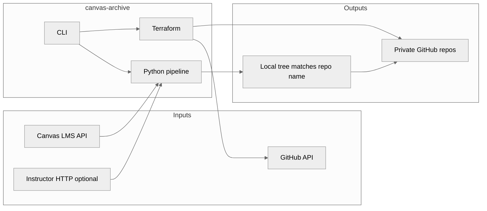
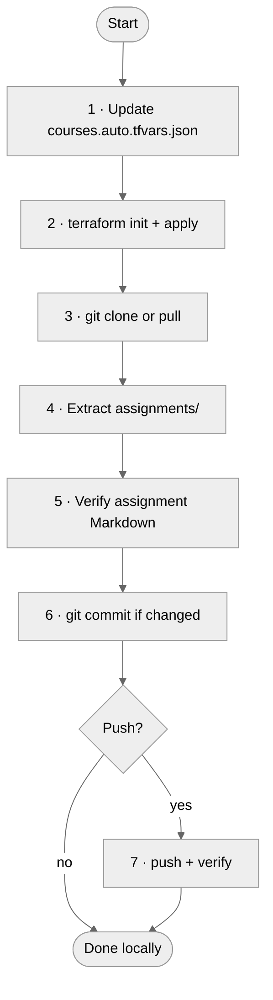
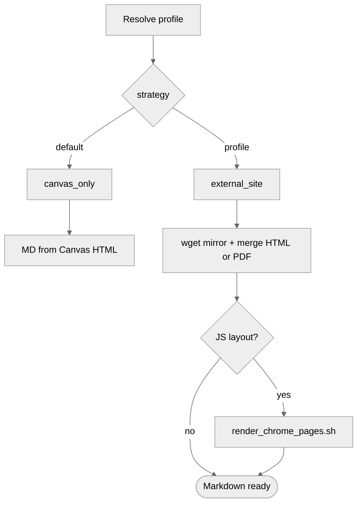

# Canvas course archive

<p align="center">
  <a href="https://www.python.org/downloads/"></a>
  <a href="https://docs.astral.sh/uv/"></a>
  <a href="https://www.terraform.io/"></a>
  <a href="https://github.com/instructure/canvas-lms"></a>
  <a href="https://github.com/"></a>
</p>

<p align="center"><strong>Personal runbook</strong> · Westminster · <code>canvas-archive</code></p>

---

## Contents

| Section | What you get |
| :-- | :-- |
| [At a glance](#at-a-glance) | One-screen facts and intent |
| [Operator workflow](#operator-workflow) | Repeatable checklist |
| [Course registry](#course-registry) | Full Canvas inventory (collapsible) |
| [Tool specifications](#tool-specifications) | Stack, dependencies, env, paths |
| [CLI reference](#cli-reference) | Commands in one table |
| [Architecture](#architecture) | Mermaid views of the system |
| [Profiles and overrides](#profiles-and-overrides) | When YAML is required |
| [Pruning and hygiene](#pruning-and-hygiene) | How to curate the list |
| [References](#references) | Links into this repo |

---

## At a glance

| Dimension | Detail |
| :-- | :-- |
| **Goal** | Archive Canvas courses into **private** Git repos with reproducible assignment Markdown and optional enrichment from instructor-hosted sites |
| **Entry point** | `canvas-archive` (see [`pyproject.toml`](../pyproject.toml) `project.scripts`) |
| **Orchestration** | Python pipeline plus Terraform for GitHub ([`src/canvas_archive/pipeline.py`](../src/canvas_archive/pipeline.py)) |
| **Local working trees** | `~/Workspace/school/canvas-extracts/canvas-archive-<slug_kebab>/` (same directory basename as the private GitHub repo[^paths]) |
| **Remote repo names** | `canvas-archive-<slug_kebab>` (Terraform map key is `<slug_kebab>` only[^paths]) |

---

## Operator workflow

Use this as a lightweight run template before and after each archive pass.

- [ ] Confirm `gh auth login` and `terraform version` on PATH
- [ ] Copy [`.env.example`](../.env.example) to `.env`; set `CANVAS_URL` and `CANVAS_TOKEN` (never commit `.env`)
- [ ] Ensure `infra/courses.auto.tfvars.json` exists (gitignored): copy [`infra/courses.auto.tfvars.example.json`](../infra/courses.auto.tfvars.example.json) **or** run `uv run canvas-archive sync-tfvars` after your `profiles/*.yaml` files are in place
- [ ] `uv sync` in the repo root when dependencies change
- [ ] `uv run canvas-archive list` and refresh the [course registry](#course-registry) in this file if enrollments shifted
- [ ] Add or edit `profiles/*.yaml` when a course needs `external_site` or slug overrides
- [ ] To (re)provision **only** GitHub repos from profiles without extracting: `uv run canvas-archive sync-tfvars` then `uv run canvas-archive terraform-apply`
- [ ] `uv run canvas-archive run <canvas_id>` then inspect `assignments/` locally
- [ ] For JS-heavy instructor pages, run [`scripts/render_chrome_pages.sh`](../scripts/render_chrome_pages.sh) when the profile calls for it
- [ ] Push only when satisfied: `uv run canvas-archive run <canvas_id> --push` or `uv run canvas-archive push <canvas_id>`

> [!IMPORTANT]
> **Push is opt-in.** Default `run` commits locally so you can diff before anything leaves your machine.

---

## Course registry

<details>
<summary><strong>Expand: full Canvas inventory (28 courses)</strong></summary>

Snapshot from `uv run canvas-archive list`. **Prune** rows you do not plan to archive (department shells, training sandboxes, duplicates). To refresh: run the same command and replace the table body.

| Canvas ID | Code | State | Name |
| :--: | :-- | :--: | :-- |
| 3438148 | `ART*180*03` | available | Photography Sect. 03 23FA |
| 3438320 | `CMPT*201*01` | available | Intro to Computer Science Sect. 01 23FA |
| 3462700 | `CMPT*202*01` | available | Intro to Data Structures Sect. 01 24SP |
| 3506972 | `CMPT*251*01` | available | Computer Systems & Programming Sect. 01 24FA |
| 3482412 | `CMPT*300F*01` | available | Functional Programming Sect. 01 24SU |
| 3521378 | `CMPT*301*01` | available | Artificial Intelligence Sect. 01 25SP |
| 3506954 | `CMPT*306*01` | available | Algorithms Sect. 01 24FA |
| 3506965 | `CMPT*307*01` | available | Databases Sect. 01 24FA |
| 3572079 | `CMPT*311*01` | available | Machine Learning Sect. 01 25FA |
| 3521375 | `CMPT*322*01` | available | Software Engineering Sect. 01 25SP |
| 3596470 | `CMPT*328*01` | available | Computer Architecture Sect. 01 26SP |
| 3521373 | `CMPT*351*01` | available | Operating Systems Sect. 01 25SP |
| 3572076 | `CMPT*352*01` | available | Computer Networks & Security Sect. 01 25FA |
| 3572065 | `CMPT*355*01` | available | Compilers Sect. 01 25FA |
| 3572071 | `CMPT*385*01` | available | Senior Project Proposal Wrtg Sect. 01 25FA |
| 3596441 | `CMPT*390*01` | available | Senior Capstone Sect. 01 26SP |
| 2324612 | Comp Science Dept. | available | Computer Science Department |
| 3462669 | `DATA*110*01` | available | Explorations in Data Science Sect. 01 24SP |
| 3438226 | `DATA*220*01` | available | Introduction to Statistics Sect. 01 23FA |
| 3462292 | `DATA*350*01` | available | Statistical Modeling Sect. 01 24SP |
| 3521670 | `DATA*360*01` | available | Data Science With Python Sect. 01 25SP |
| 3506875 | `DATA*370*01` | available | Statistical Learning Sect. 01 24FA |
| 3596309 | `DATA*470*01` | available | Capstone Project Sect. 01 26SP |
| 3596546 | `GEOL*205*01` | available | Climate Science & Solutions Sect. 01 26SP |
| 3596658 | `MATH*210*01` | available | Discrete Mathematics Sect. 01 26SP |
| 3571903 | `SOC*105*02` | available | The Sociological Imagination Sect. 02 25FA |
| 971264 | Staff Training | available | FWRD Staff Online Training |
| 3462448 | `WCSAM*203*01` | available | Linear Algebra Sect. 01 24SP |

```bash
cd /path/to/canvas-archive
uv run canvas-archive list
```

</details>

---

## Tool specifications

### Purpose (bullet architecture)

| Capability | Mechanism |
| :-- | :-- |
| Discovery | Canvas REST via `canvasapi` |
| Infra | Terraform `integrations/github` **~> 6.0** ([`infra/providers.tf`](../infra/providers.tf)) |
| Content | Assignment HTML to Markdown; optional `wget` mirror and merge |
| Safety | Local commit by default; hash-aware push verification in code |

### Python runtime and packaging

| Item | Specification |
| :-- | :-- |
| Interpreter | **Python 3.12+** (`requires-python` in [`pyproject.toml`](../pyproject.toml)) |
| Lock and install | **uv** (`uv sync`, `uv run …`) |
| Build | **Hatchling** (`[build-system]` in `pyproject.toml`) |
| Console script | `canvas-archive` → `canvas_archive.cli:main` |

### Declared Python dependencies

Pinned lower bounds are authoritative in [`pyproject.toml`](../pyproject.toml).

| Package | Version constraint | Role |
| :-- | :-- | :-- |
| `canvasapi` | >= 3.6.0 | Canvas REST client |
| `markdownify` | >= 1.2.2 | HTML → Markdown (descriptions, mirrored pages) |
| `pypdf` | >= 6.10.2 | PDF handling where the extractors need text or sidecar files |
| `python-dotenv` | >= 1.2.2 | Load `.env` for Canvas credentials |
| `pyyaml` | >= 6.0.3 | Parse `profiles/*.yaml` |

Transitive packages (HTTP stacks, parsers) follow whatever those versions resolve to under `uv lock`.

### Host toolchain (outside PyPI)

| Binary | Role in pipeline |
| :-- | :-- |
| `git` | Clone, commit, push archive working trees |
| `gh` | Supplies `GITHUB_TOKEN` to Terraform via `gh auth token` |
| `terraform` | Apply GitHub resources (required **>= 1.6** in HCL[^tfmin]) |
| `wget` | Recursive fetch for `external_site` mirrors |
| Google Chrome | Optional: headless DOM dump for [`scripts/render_chrome_pages.sh`](../scripts/render_chrome_pages.sh) |
| `pandoc` | Optional: HTML → GFM in the same script |

### Environment variables

| Variable | Required | Consumed by |
| :-- | :--: | :-- |
| `CANVAS_URL` | Yes | [`canvas_archive/core/canvas.py`](../src/canvas_archive/core/canvas.py) |
| `CANVAS_TOKEN` | Yes | Same |
| `GITHUB_TOKEN` | At apply time | Terraform (via `gh auth token` in pipeline) |
| `CHROME` | No | `render_chrome_pages.sh` when overriding Chrome path |

> [!CAUTION]
> **Never** commit `.env`, tokens, or Terraform secrets. `courses.auto.tfvars.json` is **gitignored**; use [`infra/courses.auto.tfvars.example.json`](../infra/courses.auto.tfvars.example.json) as a template or run `sync-tfvars` so a fresh clone can reach Terraform apply without losing your local map.

### Repository map (quick navigation)

| Path | Responsibility |
| :-- | :-- |
| [`src/canvas_archive/cli.py`](../src/canvas_archive/cli.py) | argparse subcommands |
| [`src/canvas_archive/pipeline.py`](../src/canvas_archive/pipeline.py) | tfvars, apply, clone, extract, verify homework `.md`, commit, push |
| [`src/canvas_archive/core/`](../src/canvas_archive/core/) | Canvas, git, markdown, slug helpers |
| [`src/canvas_archive/extractors/`](../src/canvas_archive/extractors/) | `canvas_only`, `external_site` |
| [`profiles/`](../profiles/) | Per-`canvas_id` YAML overrides |
| [`infra/`](../infra/) | Terraform modules, `courses.auto.tfvars.json` (gitignored; start from [`courses.auto.tfvars.example.json`](../infra/courses.auto.tfvars.example.json) or `sync-tfvars`) |

---

## CLI reference

| Command | What it does |
| :-- | :-- |
| `uv run canvas-archive list` | Enumerate visible Canvas courses (source for the registry table) |
| `uv run canvas-archive run <canvas_id>` | Full pipeline (seven steps); add `--push` to push in the same invocation |
| `uv run canvas-archive sync-tfvars` | Merge `profiles/*.yaml` + Canvas into `infra/courses.auto.tfvars.json` (add `--prune` to drop entries not in any profile) |
| `uv run canvas-archive terraform-apply` | `terraform init` + `terraform apply` in `infra/` (no Canvas extract) |
| `uv run canvas-archive verify-assignments-md <canvas_id>` | Fail if any `assignments/**/*.md` still contains `data:image` / `data:application` or lines over 20k characters |
| `uv run canvas-archive verify-homework-md <canvas_id>` | Same as `verify-assignments-md` (alias) |
| `uv run canvas-archive run-all` | Every `profiles/*.yaml` that includes a `canvas_id` |
| `uv run canvas-archive show-profile <canvas_id>` | Resolved YAML or default `canvas_only` |
| `uv run canvas-archive push <canvas_id>` | Push an existing local archive after you have reviewed commits |

---

## Architecture

### System context



### Seven-step `run` pipeline



### Extraction strategies



---

## Profiles and overrides

| Situation | What happens |
| :-- | :-- |
| No `profiles/*.yaml` for a `canvas_id` | **`canvas_only`**: one `.md` per assignment under `assignments/<group>/` from Canvas description HTML; global skip for meaningless auto-assignments (Roll Call Attendance) |
| `strategy: external_site` | Mirror `external_site.base_url`, match assignment names with regex `assignment_patterns`, merge or attach files, then delete the mirror tree |
| `download_linked_canvas_files`, `refetch_assignment_description`, `module_files_before_assignment`, `assignment_files_from_course_home_table` | See [profiles/README.md](../profiles/README.md): pull files from description links, course **home** wiki **Assignments** column, optionally refetch each assignment from the show API, and optionally collect **File** module items above the assignment in Modules |
| JS-rendered instructor tables | Use [`scripts/render_chrome_pages.sh`](../scripts/render_chrome_pages.sh) after extraction when plain `wget` HTML is empty |

Full schema: [profiles/README.md](../profiles/README.md).

---

## Pruning and hygiene

1. **Drop** registry rows that are not real coursework (department meta, staff training, duplicates).
2. **Decide** whether each remaining course needs a **profile** (most use defaults; external prompts need YAML).
3. **Run** `uv run canvas-archive run <canvas_id>` and review `git diff` before any `--push`.
4. **Rotate** Canvas tokens on a sane schedule; invalidate any token that touched a shared screen.

---

## References

| Document | Topic |
| :-- | :-- |
| [README.md](../README.md) | Operator guide, design boundaries, quick start |
| [profiles/README.md](../profiles/README.md) | YAML schema for per-course overrides |
| [OBSERVABILITY.md](OBSERVABILITY.md) | JSON logs, golden signals vocabulary, future Prometheus or Grafana notes |
| [`.env.example`](../.env.example) | Minimum Canvas environment template |

---

*Registry snapshot: `canvas-archive list` on **2026-05-13** (America/Denver). Update the table when your enrollments change.*

[^paths]: Local path is `local_archive_path()` in [`pipeline.py`](../src/canvas_archive/pipeline.py): `EXTRACTS_ROOT / (repo_prefix() + "-" + slug_kebab)` (see `CANVAS_ARCHIVE_REPO_PREFIX` in [`.env.example`](../.env.example)).

[^tfmin]: [`infra/providers.tf`](../infra/providers.tf) specifies `required_version = ">= 1.6"`.
