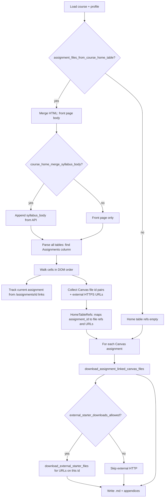

# Scratch: assignment starter file extraction (delete when stable)

This note is only to visualize **where downloaded assignment-related files come from**. Remove this file once behavior is confirmed or folded into the main runbook.

## What “assignment download files” means here

Not the assignment **title** or **description** text alone: it means **binary or notebook starters** saved next to the generated `.md`:

| Kind | Typical source | On disk (under `assignments/<group>/`) |
| --- | --- | --- |
| **Canvas files** | `/courses/…/files/<id>` links in assignment HTML **or** in the home schedule table | `assignments/<group>/<assignment-dir>/canvas/…` |
| **Instructor host** | Full `https://…` links to allowed hosts with allowed extensions (for example `.ipynb`, `.py`) in the schedule **Assignments** column | `assignments/<group>/<assignment-dir>/external/…` |

Each assignment `.md` can get appendix sections: **Canvas file attachments** and **External starter files (instructor host)**.

## End-to-end flow (canvas_only + profile flags)

## Preconditions that must be true for **home table** starters

1. **`assignment_files_from_course_home_table: true`** in the course profile.
2. **Merged HTML actually contains a `<table>`** with a detectable **Assignments** column (header text contains “assignment”, or the column is inferred by link density).
3. **For instructor downloads:** `course_home_external_download_hosts` (or `follow_description_links.host_allowlist`) lists the file host, and the link path ends with an allowed extension (default `.ipynb`, `.py`, `.zip`).

If the schedule table exists in the browser but **not** in `show_front_page().body` or `course.syllabus_body` for your token, parsing finds nothing. When the Canvas home is **only an iframe**, list the iframe `src` under **`course_home_supplement_html_urls`**. Relative links in that HTML (for example `./assignments/.../file.ipynb`) are resolved against the **first** URL in that list. You can still set **`course_home_file_table_page_slug`** if the table lives on another wiki page instead.

## Preconditions for **Canvas-linked** starters (description + modules)

Separate from the table: **`download_linked_canvas_files`** and related profile keys drive pulls from the assignment description HTML and from module-adjacent Canvas files. Those paths do not require the home table.

## Quick debug checklist

1. Read the extractor log line starting with **`course_home_table:`** after a run.
2. On disk, search the archive for **`external/`** and **`canvas/`** under each ``assignments/<group>/<assignment-dir>/``.
3. Open a representative `.md` and look for the appendix headings at the bottom.
