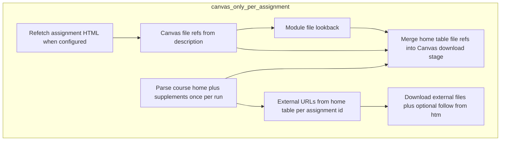
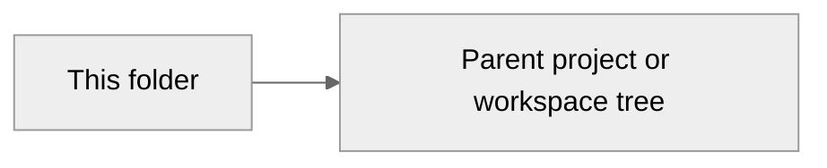

# Course profiles

<p align="center">
  <a href="../../../automation/workspace-standards/README.md"></a>
  <a href="../../../automation/templates/github-markdown/DOCUMENT_TEMPLATE.md"></a>
</p>

<p align="center"><strong>README</strong> · <code>portfolio/canvas-archive/profiles/README.md</code></p>

---

## Contents

| Section | Purpose |
| :-- | :-- |
| [Overview](#overview) | Audience, goal, and scope |
| [Workflow](#workflow) | Procedures and checklists |
| [Deep dive](#deep-dive) | Prior README text preserved below |
| [Architecture](#architecture) | Context diagram |
| [References](#references) | Links to workspace canon |

---

## Overview

| Field | Value |
| :-- | :-- |
| **Audience** | Readers navigating this repository area |
| **Goal** | Document layout, behavior, or pointers for this folder |
| **Owner** | Repository maintainer |

> [!NOTE]
> This file follows the workspace README shell. Edit **Overview** and **Workflow** above the preserved block, or revise content inside **Deep dive**.

---

## Workflow

- [ ] After substantive edits, confirm the **Deep dive** preserved section still matches reality.
- [ ] Run `~/Workspace/automation/ssvc/validate.sh` when changing Markdown under umbrella default lint paths.
- [ ] For multi-course UAT, follow [docs/UAT-wave-202-306-328.md](docs/UAT-wave-202-306-328.md) and refresh extract logs there when runs complete.

---

## Adaptive starter resolution (`canvas_only`)

Extraction is an **ordered multi-stage pipeline**, not dynamic programming: there is no score to optimize across subproblems. Value comes from **short-circuit friendly stages**, **repeatable ordering**, and **memo-style reuse** where it is safe (for example one parse of the course home table per run, and optional URL dedupe for external downloads).



### Memoization boundaries

| Cache or reuse | Where | Notes |
| :-- | :-- | :-- |
| Parsed home table | [canvas_only.py](../src/canvas_archive/extractors/canvas_only.py) calls `parse_course_home_tables` once before the assignment loop | Same `HomeTableRefs` reused for every assignment. |
| HTTP 403 URL list | `~/.cache/canvas-archive/fetch_403_urls.txt` via [fetch_403_cache.py](../src/canvas_archive/core/fetch_403_cache.py) | Skips repeat fetches across runs. |
| Optional same-URL binary dedupe | `dedupe_external_download_urls` profile flag + in-run dict in [assignment_external_download.py](../src/canvas_archive/core/assignment_external_download.py) | Default off; when on, first successful GET for a URL is copied to later assignment `external/` folders without another download. |

### `external_site` strategy (306 / 328)

Mirror with `wget`, match Canvas assignment names to mirrored paths, copy starters. See [docs/CMPT328-external-site-and-js-render.md](docs/CMPT328-external-site-and-js-render.md) when pages are JavaScript-heavy.

### UAT versus production profile checklist

| Item | UAT / discovery | Production-ready archive |
| :-- | :-- | :-- |
| `developer_mode` | `true` only while you still discover unknown instructor hosts for schedule starters | `false` or omit when the course is finished |
| `course_home_external_download_hosts` | May be partial early | Must list every instructor host you intend to trust for table downloads |
| `course_home_external_starters_allow_any_https_host` | Never set `true` without `developer_mode: true` | Pipeline **exits** if you pair allow-any-https with `developer_mode` off ([profile_lockdown.py](../src/canvas_archive/core/profile_lockdown.py)) |
| `course_home_follow_links_in_external_html` | Use when spec pages link zips (CMPT 301 Pacman) | Keep explicit extensions under `course_home_external_html_follow_extensions` |
| JSON metrics | Set `CANVAS_ARCHIVE_LOG_JSON=1` | Same; see [observability.py](../src/canvas_archive/observability.py) for `extract_complete` and `run_complete` fields |

Lessons from **CMPT 301** that other profiles reuse: **Activities** column text for ambiguous filenames (`course_home_activity_row_priority_filename_stems`), **first matching hint** for starter links, and **follow-from-downloaded** `.htm` when the table only links specs.

---

## Deep dive

<details>
<summary><strong>Prior README content (preserved)</strong></summary>

Per-course config for the canvas-archive pipeline. One YAML file per course where the prof's content layout differs from the default (Canvas description fields). Courses without a profile file default to the `canvas_only` strategy.

## Schema

```yaml
canvas_id: <int>            # Canvas course id (required, identifies the profile)
slug_kebab: <str>           # Terraform map key and GitHub repo suffix: canvas-archive-<slug_kebab>
                             # Local clone directory uses the same full repo basename under EXTRACTS_ROOT
strategy: canvas_only | external_site

# Required when strategy == external_site:
external_site:
  base_url: https://...     # prof's site root (passed to wget --recursive --no-parent)
  assignment_patterns:
    - regex: "^lab(\\d+)$"  # matched against lowercased assignment name
      candidates:           # tried in order; {n} = first regex group
        - "labs/lab{n}/index.html"
        - "labs/lab{n}/lab{n}.pdf"
      starters:             # optional; binary files copied alongside the .md
        - "labs/lab{n}/lab{n}.tar"
  handouts_dir: handouts    # optional; subdir of base_url with explainer pages

# Optional on any strategy (typically canvas_only): follow one instructor URL from the
# Canvas HTML description and append its body as Markdown. Use when the Canvas text is
# only a pointer ("follow these instructions") and the real spec lives on an allowlisted host.
follow_description_links:
  host_allowlist:           # required; exact or subdomain match on URL hostname only
    - cs.westminstercollege.edu
    - cs.westminsteru.edu
  # Mode A: list Canvas assignment group name substrings (homework, quiz, lab, …).
  only_assignment_groups:
    - homework
  # Mode B: omit only_assignment_groups (or set to null) to consider ALL groups, but only
  # when the Canvas HTML plaintext is short (submission shell + link). Default max 900
  # characters; set follow_max_canvas_plaintext_chars to false to disable that guard.
  merged_section_title: Instructor-hosted description   # optional heading above merged body
  pause_seconds_between_requests: 0.35   # optional delay after each successful fetch

# Optional: download Canvas-hosted files linked from the assignment HTML (URLs like
# /courses/<id>/files/<file_id>). Saves under ``assignments/<group>/<assignment-dir>/canvas/``
# and appends a "## Canvas file attachments" section to the Markdown.
download_linked_canvas_files: true   # or false / omit for default (no downloads)

# Optional: parse the course home wiki table (header column containing "assignment") and
# map /files/ links from that column to assignment ids (see assignment_files_from_course_home_table).
assignment_files_from_course_home_table: true

# Optional: wiki page url slug if the schedule table is not on the default front page.
# course_home_file_table_page_slug: course-schedule

# When assignment_files_from_course_home_table is true, also scan syllabus HTML (requires course API include).
course_home_merge_syllabus_body: true   # or false to use only the wiki front page slug above

# Optional: extra HTML pages to merge into the schedule scan (for example when the Canvas home is
# only an iframe and the real weekly table lives on an instructor URL). Each URL must hit
# course_home_external_download_hosts unless developer_mode is true. Relative `href` values in
# that HTML are resolved against the **first** URL in this list (put the calendar page first).
# course_home_supplement_html_urls:
#   - https://cs.westminstercollege.edu/~jingsai/courses/CMPT301/calendar_dyn

# Developer mode: relax schedule-table external starter host checks (any http(s) host if the path
# ends with the configured extensions). Set false when the course archive is complete. Supplement
# URLs still must be listed explicitly below; this flag does not invent URLs.
# developer_mode: true

# Hosts allowed for direct .ipynb / .py downloads linked from the home table (instructor web tree).
course_home_external_download_hosts:
  - cs.westminstercollege.edu
  - cs.westminsteru.edu

# Optional: path suffixes treated as downloadable schedule starters (default .ipynb, .py, .zip).
# Add .htm / .html when the table links to instructor assignment pages (not only notebooks).
# course_home_external_file_extensions:
#   - .ipynb
#   - .py
#   - .zip
#   - .htm

# Optional: skip the host allowlist for schedule-table external starters only. Links must still
# be absolute http(s) URLs whose path ends with course_home_external_file_extensions (default
# .ipynb, .py, .zip). Prefer course_home_external_download_hosts when you can name the hosts;
# use this flag only for trusted courses where you need links from arbitrary domains.
# course_home_external_starters_allow_any_https_host: true

# Optional: refetch each assignment with GET .../assignments/:id (some courses omit HTML on the index).
refetch_assignment_description: true

# Optional: download Canvas File module items that sit above the assignment in the same module
# (empty description + files only in Modules). Tuning knobs:
module_files_before_assignment: true
module_file_lookback_items: 20        # max module rows to scan upward per assignment
module_files_max_per_assignment: 15 # cap File items collected per assignment hit

# After downloads, remove files under ``assignments/<group>/<assignment-dir>/canvas/`` that no longer match current refs (avoids stale duplicates).
prune_orphan_canvas_files: true

# Optional: second GET for same external URL in one run copies bytes from the first success (default off).
# dedupe_external_download_urls: true

# Optional future: ordered list of stage ids to override defaults (not implemented in code; reserved).
# starter_resolution_order: [description, modules, home_table, external_http]

# Optional: JSON logs on stderr for dashboards later (see src/canvas_archive/observability.py). Set CANVAS_ARCHIVE_LOG_JSON=1 in .env.
```

HTTP **403** responses for a given URL are appended to `~/.cache/canvas-archive/fetch_403_urls.txt` and never requested again (same run or future runs). Delete that file to reset.

Some courses (for example CMPT 301) keep the syllabus grid on the [course home](https://westminster.instructure.com/courses/3521378) while Canvas assignment descriptions stay almost empty. If the home **API body is only an iframe**, add **`course_home_supplement_html_urls`** with the iframe `src` so the schedule table is merged for parsing. Enable **`assignment_files_from_course_home_table`** so file links in the **Assignments** column map to downloads. Use **`developer_mode: true`** only while you are actively archiving; set it to **false** when finished so external starters again require **`course_home_external_download_hosts`** (or the explicit per-flag override below). **Activities** that point at Google Docs are fine as links inside the exported `.md`. When files are only in **Modules** as File rows above an assignment, use `module_files_before_assignment` (and usually `refetch_assignment_description`).

Filename = `<canvas_id>-<slug_kebab>.yaml` is conventional but only `canvas_id` matters for matching.

To keep GitHub Terraform variables aligned with the same files, run `uv run canvas-archive sync-tfvars` (writes `infra/courses.auto.tfvars.json`, merge by default; `--prune` drops courses not present in any profile).

</details>

---

## Architecture



---

## Markdown lint checklist (workspace)

These align with the workspace [`.markdownlint.json`](../../../.markdownlint.json) when that file is reachable from this path (nested repos often pick up config via guardrail hooks walking up to the workspace root).

- **Fenced code blocks:** declare a language (`bash`, `text`, `mermaid`, …).
- **Headings and lists:** keep one blank line after a heading before lists or body text.
- **Tables:** align pipes with the header row.

---

## References

| Resource | Notes |
| :-- | :-- |
| [DOCUMENT_TEMPLATE.md](../../../automation/templates/github-markdown/DOCUMENT_TEMPLATE.md) | Canonical GitHub Markdown shell |
| [Workspace standards README.md](../../../automation/workspace-standards/README.md) | Bronze / Silver / Gold rubric |
| [CLAUDE.md](../../../CLAUDE.md) | Workspace index |

---

<!-- readme-normalize: workspace-template v1 -->
